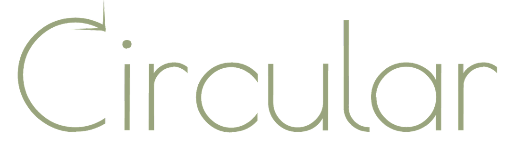
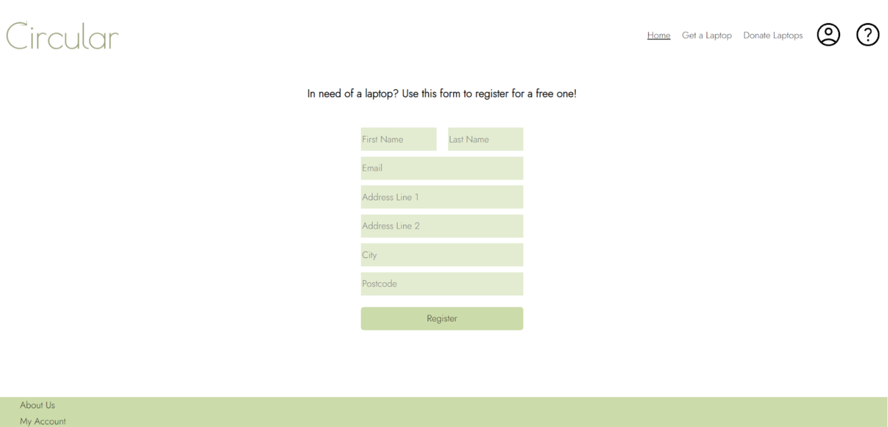
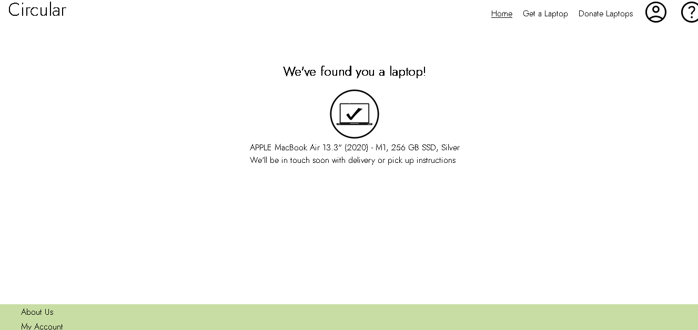
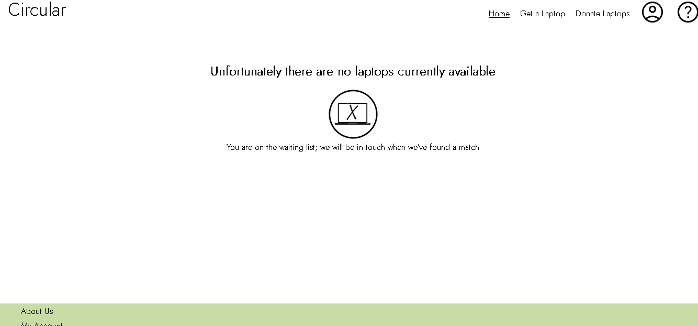

## About

Circular is a platform to connect individuals in need with ex-industry devices donated by companies who want to improve their environmental impact and get some good press in the process.

Companies and institutions can donate industry standard laptops which still work, but have reached the end of the corporate lifestyle.
This means that individuals can acquire a laptop free of charge which can improve their communication, education, and career perspectives


## How to run

In the terminal, in the laptop-library directory, run the following commands:

```python -m venv /path/to/new/virtual/environment```

```c:\>python -m venv c:\path\to\myenv```

```pip install -r requirements.txt```

```python -m server.app```

## Developement

We mocked up the design for our main pages on [Figma](https://www.figma.com/file/dP2YWrHYe0MF2sVZQS9Lr5/Athena---Laptop-Library?node-id=0%3A1)

We used Vue.js for our frontend and Flask for the backend.

## Main pages




## Journeys


## Assumptions
- Users are requesting laptops within the UK
- Laptops limited to certain cities
- User will be assigned

## Threat Modeling
